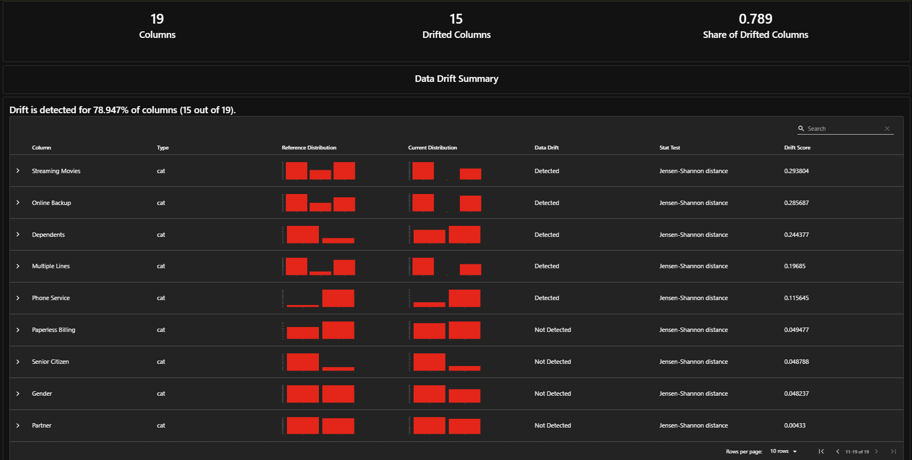

# Churn Model Deployment


End-to-end machine learning project: from model training to a production-ready,
containerized API with automated testing and monitoring. Built to demonstrate the
full lifecycle of taking a data science solution from experimentation to
production, testing it, and deploying it in a containerized, CI-tested,
monitored setup.

## Project Status

| Phase | Description | Status |
|---|---|---|
| 1. Model Training | EDA + churn classification model | ✅ Done |
| 2. API | FastAPI service serving predictions | ✅ Done |
| 3. Containerization | Docker + docker-compose | ✅ Done |
| 4. Testing & CI | pytest + GitHub Actions | ✅ Done |
| 5. Monitoring | Prediction logging + data drift detection | ✅ Done |
| 6. LLM Explainability | Natural-language prediction explanations | ⬜ Pending |
| 7. Kubernetes | Local deployment manifests | ⬜ Pending |

## Problem

Predicting customer churn for a telecom provider, using the IBM-extended
version of the Telco Customer Churn dataset (7,043 customers, 33 raw columns).
The goal is to flag customers likely to cancel their service so retention
efforts can be targeted a classic, high-value business use case for
classification models.

Columns that leak post-outcome information (`Churn Score`, `CLTV`,
`Churn Reason`, and the duplicate `Churn Label`) were identified and removed
before modeling these are either derived from another model's predictions
or only populated for customers who already churned, and would make any
model trained on them look artificially strong while being useless in
production, where that information isn't available at prediction time.

## Approach

- **Baseline overall churn rate**: 26.54% (moderate class imbalance 
  `class_weight="balanced"` used in both candidate models).
- **Models compared**: Logistic Regression vs. Random Forest.
- **Selection metric**: recall on the churn class, not accuracy — in this
  business context, a missed churner (false negative) is more costly than
  a false alarm (unnecessary retention outreach).

| Model | Churn Recall | Churn Precision | ROC-AUC |
|---|---|---|---|
| **Logistic Regression** (chosen) | **0.78** | 0.51 | **0.8489** |
| Random Forest | 0.52 | 0.63 | 0.8322 |

Logistic Regression was selected for catching significantly more actual
churners, despite a higher false-positive rate the right trade-off for
this use case.

## Tech Stack

- **Model**: scikit-learn (Logistic Regression, `ColumnTransformer` pipeline)
- **API**: FastAPI + Pydantic v2
- **Testing**: pytest, FastAPI `TestClient`
- **Containerization**: Docker, docker-compose
- **CI/CD**: GitHub Actions (automated test run on every push/PR to `main`)
- **Monitoring**: Evidently (data drift), custom prediction logging (JSON lines)
- **Explainability**: SHAP + LLM via Anthropic API *(planned)*
- **Orchestration**: Kubernetes, local via Minikube *(planned)*

## Repository Structure

churn-model-deployment/
├── .github/workflows/
│ └── ci.yml # CI: runs tests on every push/PR
├── api/ # FastAPI service
│ ├── main.py # App, /health and /predict endpoints
│ └── schemas.py # Pydantic request/response models
├── data/raw/ # Raw dataset (IBM Telco Customer Churn, extended)
├── k8s/ # Kubernetes manifests (Phase 7)
├── logs/ # Prediction logs + drift reports (gitignored)
├── models/ # Serialized trained model (churn_model.pkl)
├── notebooks/
│ ├── 01_eda_and_model_training.ipynb
│ └── 02_drift_detection.ipynb # Data drift analysis (reference vs. production logs)
├── src/
│ ├── data_pipeline.py # load_data, clean_data, feature/preprocessing helpers
│ └── monitoring.py # log_prediction() — appends each request to logs/predictions.log
├── tests/
│ └── test_api.py # API endpoint tests
├── Dockerfile # Builds the API serving image
├── docker-compose.yml # Runs the containerized API locally
├── requirements.txt # Full dev environment (training, notebooks, testing)
└── requirements-api.txt # Lean runtime deps for the API/Docker image


## API

### `GET /health`
Returns `{"status": "ok"}` basic liveness check.

### `POST /predict`
Accepts customer feature data, returns a churn prediction and probability.
Every request is logged to `logs/predictions.log` for monitoring (see below).

**Example request:**
```json
{
  "Gender": "Male",
  "Senior Citizen": "No",
  "Partner": "No",
  "Dependents": "No",
  "Tenure Months": 100,
  "Phone Service": "Yes",
  "Multiple Lines": "No",
  "Internet Service": "DSL",
  "Online Security": "Yes",
  "Online Backup": "Yes",
  "Device Protection": "No",
  "Tech Support": "No",
  "Streaming TV": "No",
  "Streaming Movies": "No",
  "Contract": "Month-to-month",
  "Paperless Billing": "Yes",
  "Payment Method": "Mailed check",
  "Monthly Charges": 0,
  "Total Charges": 0
}
```

**Example response:**
```json
{
  "churn_prediction": "No",
  "churn_probability": 0.028
}
```

All fields are validated with Pydantic (`Literal` types for categoricals,
numeric bounds for continuous fields) invalid input returns a `422` error
instead of silently reaching the model.

## Monitoring



Every `/predict` call is logged to `logs/predictions.log` as a JSON line
(input features, prediction, probability, timestamp), independent of whether
the API runs locally or in Docker (the log directory is mounted as a volume
in `docker-compose.yml`).

`notebooks/02_drift_detection.ipynb` uses [Evidently](https://www.evidentlyai.com/)
to compare the distribution of logged production requests against the
original training data, flagging feature-level and dataset-level drift.
Running it against the initial batch of manual test requests correctly
detected drift on 15 of 19 features (78.9%) expected, since those requests
were crafted edge cases rather than a representative sample, and confirms
the drift detection pipeline is sensitive enough to catch a real
distribution shift when it occurs in production traffic.

## How to Reproduce

### Option A — Docker (recommended, matches production setup)

```bash
git clone https://github.com/JFGBMath/churn-model-deployment.git
cd churn-model-deployment

docker build -t churn-model-api .
docker compose up
# API available at http://localhost:8000/docs
```

### Option B — Local development (for notebooks / retraining)

```bash
git clone https://github.com/JFGBMath/churn-model-deployment.git
cd churn-model-deployment

python -m venv venv
source venv/Scripts/activate   # Windows Git Bash; use venv\Scripts\activate on CMD

pip install -r requirements.txt

# Train the model (or use the one already in models/)
jupyter notebook notebooks/01_eda_and_model_training.ipynb

# Run the API locally
uvicorn api.main:app --reload
# Visit http://127.0.0.1:8000/docs for interactive Swagger UI

# Run tests
pytest tests/ -v

# Run drift analysis
jupyter notebook notebooks/02_drift_detection.ipynb
```

## License

MIT

## Author

Jesús Fernando Gómez Brito ([LinkedIn](https://www.linkedin.com/in/jes%C3%BAs-fernando-g%C3%B3mez-brito-02a895279))